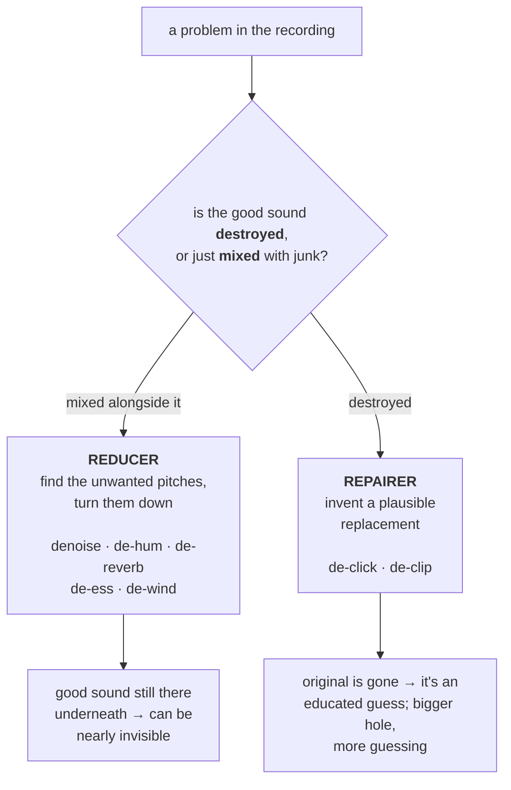

# The repair toolbox: what breaks, and the "de-" family

Before we open up each tool, here's the lay of the land — the common ways a
recording goes wrong, and the tool that addresses each. You'll notice almost
everything starts with "de-": de-noise, de-hum, de-click. That little prefix just
means "take away."

| What you hear | What it is | The tool |
| --- | --- | --- |
| A steady background *shhhhh* | **Noise / hiss** — even, random energy across the high end | denoise |
| A low *hummmm* or buzz | **Mains hum** — electrical 50/60-cycle leakage and its echoes | de-hum |
| Sharp *tick*s and *pop*s | **Clicks** — brief spikes (vinyl dust, bad digital edits) | de-click |
| A harsh, fuzzy, "broken speaker" tone on loud bits | **Clipping** — peaks chopped flat by overload | de-clip |
| It sounds like it's in a bathroom | **Reverb** — the room's echoes smearing the sound | de-reverb |
| Piercing *ssss* and *sshhh* | **Sibilance** — over-loud consonants | de-ess |
| A low *whoomph* on outdoor recordings | **Wind** — turbulence rumbling the mic | de-wind |
| A thump on every "p" and "b" | **Plosives** — breath bursts hitting the mic | de-plosive |
| Scratchy noise when someone moves | **Rustle** — clothing against a clip-on mic | de-rustle |
| Too quiet / too loud / inconsistent | **Level** — wrong loudness for delivery | normalize |
| Muffled, "telephone-y" | **Lost highs** — squashed by heavy compression | enhance |
| Boomy, dull digitized vinyl | **RIAA curve** — playback de-emphasis not applied | riaa |
| Gritty "stair-step" quiet passages | **Quantization grain** — too few stored levels | dequantize |

## Two big families

Look closely and the tools split into two families, and the split matters because
it tells you what's *possible*.

**Reducers** turn down something unwanted that's mixed *alongside* the good
sound: hiss, hum, reverb, sibilance, wind. These work in the frequency view from
the last chapter — find the unwanted pitches, turn them down, leave the rest. The
good news: the wanted sound is still there underneath, so a careful reduction can
be nearly invisible. The catch: if the unwanted thing overlaps the wanted thing
too much, turning one down dents the other (this is where the "underwater"
artefact comes from when people over-do noise reduction).

**Repairers** rebuild sound that's been *destroyed* — clicks that punched a hole
in the waveform, or clipping that chopped the tops off. Here the original is
genuinely *gone*, and the tool has to *invent a plausible replacement* from the
surrounding good audio, like an art restorer repainting a scratched corner of a
canvas. The good news: done well, you can't tell. The honest catch: it's a guess,
and the bigger the hole, the more it's guessing.

Keeping these two families straight saves you a lot of disappointment. Asking a
*reducer* to remove hiss that's quieter than the voice? Easy. Asking a *repairer*
to perfectly rebuild a badly clipped scream? It'll help, but don't expect a
miracle — there was no original left to recover.

## A golden rule of order

When you chain several fixes, order matters. A good default, and roughly the
order cathar's chapters follow:

1. **Repair destruction first** — de-click, de-clip. (You don't want later tools
   analysing damaged samples.)
2. **Remove steady offenders** — de-hum, then de-noise.
3. **Tame the spectral stuff** — de-reverb, de-ess.
4. **Shape and deliver last** — enhance, then set the loudness.

With the map in hand, let's open the tools one at a time — starting with the most
common complaint of all: hiss.
